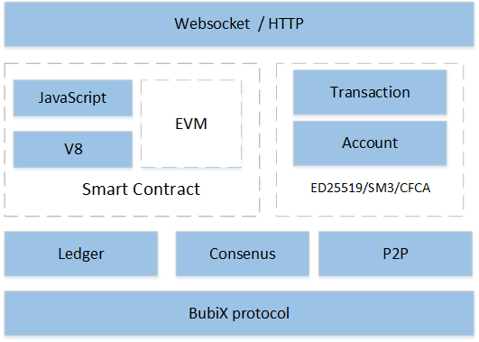

  
 
## __简介__

布比区块链由布比(北京)网络技术有限公司发起并研发，旨在推动区块链技术的发展与应用。目前布比区块链正被广泛应用于商业积分、电子券、预付卡、游戏装备、保险卡单、证券化资产等领域。

- __去中心化__ 
采用P2P分布式存储，没有中心化的管理节点，可根据实际需求配置若干个验证节点，所有的验证节点具备相同的权利。

- __智能合约__ 
目前支持 JavaScript 语言，并由高效的 V8 引擎执行。并且后续将移植 EVM 虚拟机。

- __安全__ 
数据经过验证节点之间达成共识然后才可添加至区块链、支持节点通过证书接入并加密通信连接、节点的变更需共识。

- __高效__ 
通过优化数据结构、采用高效加密算法、关键路径多线程并发，使得性能提高明显，普通 PC 节点可以达 3000TPS。

- __稳定__
布比区块链已经商用于布萌数字资产平台一年多，目前（2017年5月7日）累积用户数1013万，周新增用户数14万，周新增交易数110万。

- __合规__
除了高效的 ED25519 签名算法，同时还支持 SM2/SM3 加密算法，

- __可移植__ 
使用标准C++开发，支持 Windows、Linux 等各种平台

## __架构__

## __使用说明__

参见[布比区块链使用文档](docs/manual.md "") 

##  __开发文档__

参见[布比区块链开发文档](docs/develop.md "") 

## __License__
bubichain is under the Apache 2.0 license.